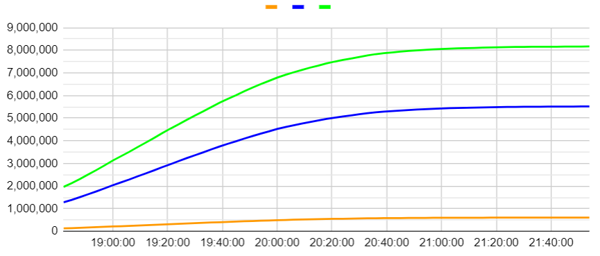

# 2020 總統開票紀錄

資料來源：中選會 
開票後才想到可以記錄，因此18:03:01後才有  
又由於一開始code寫的爛有部分(18:42:01前)只有比例沒有票數  
有需要歡迎自取
### 簡易表格

### 資料結構(未有票數)

    {
       time: [
        {
    		person,
    		percent    	
        },
        {
    		person,
    		percent    	
        },
        {
    		person,
    		percent    	
        },
    	{
    		process
    	}
        ],
        time:[
            ...
        ]
    }

### 資料結構(有票數)

    {
        time: [
            {
                person
                tickets
                percent
            },
            {
                person
                tickets
                percent
            },
            {
                person
                tickets
                percent
            },
            {
                process
            }
        ],
        time:[
            ...
        ]
    }

